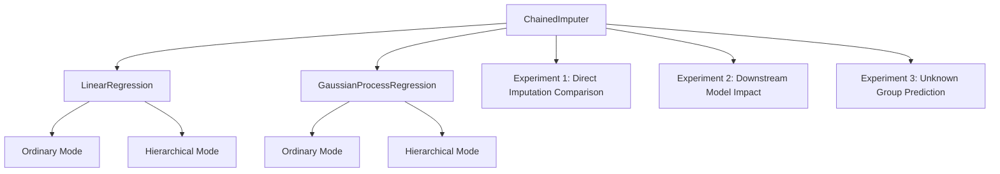

# Design Document

## Overview

本系统实现分层高斯过程回归框架,用于处理土木工程实验数据中的缺失值和多来源差异。核心设计包括一个通用的链式多重插补类和两个可抽样的回归模型(线性回归和高斯过程回归),每个模型都支持普通和分层两种运行模式。

## Architecture

系统采用模块化设计,分为三个主要层次:

1. **模型层**: 实现基础回归模型(线性回归和高斯过程回归)
2. **插补层**: 实现链式多重插补逻辑
3. **实验层**: 三个独立的Jupyter notebook实验



## Components and Interfaces

### 1. Base Model Interface

所有回归模型需要实现的接口:

```python
class BaseModel:
    def fit(self, X, y, random_effects=None):
        """训练模型
        
        Args:
            X: 输入特征
            y: 目标变量
            random_effects: 随机效应列名列表(可选,用于分层模型)
        """
        pass
    
    def predict(self, X, return_std=False):
        """预测
        
        Args:
            X: 输入特征
            return_std: 是否返回预测不确定性
            
        Returns:
            predictions: 预测值
            std: 预测标准差(如果return_std=True)
        """
        pass
    
    def sample(self, X, n_samples=1):
        """从后验分布抽样
        
        Args:
            X: 输入特征
            n_samples: 抽样次数
            
        Returns:
            samples: 抽样结果
        """
        pass
```

### 2. ChainedImputer Class

链式多重插补类设计:

```python
class ChainedImputer:
    def __init__(self, base_model, random_effects=None, n_imputations=5, max_iter=10):
        """
        Args:
            base_model: 基础回归模型实例
            random_effects: 随机效应列名列表
            n_imputations: 多重插补次数
            max_iter: 链式插补最大迭代次数
        """
        self.base_model = base_model
        self.random_effects = random_effects
        self.n_imputations = n_imputations
        self.max_iter = max_iter
    
    def fit_transform(self, X):
        """执行多重插补
        
        Args:
            X: 包含缺失值的数据
            
        Returns:
            imputed_datasets: 多个插补后的数据集列表
        """
        pass
```

**设计决策**: 使用链式方法(chained equations)而非联合建模,因为链式方法更灵活,可以为每个变量使用不同的模型。

### 3. LinearRegression Model

线性回归模型设计:

- **普通模式**: 使用标准贝叶斯线性回归,利用共轭先验实现解析后验
- **分层模式**: 使用混合效应模型,通过PyMC或statsmodels实现随机效应

**实现方案**: 使用`sklearn.linear_model.BayesianRidge`作为普通模式基础,使用`statsmodels.regression.mixed_linear_model.MixedLM`实现分层模式

### 4. GaussianProcessRegression Model

高斯过程回归模型设计:

- **普通模式**: 标准高斯过程回归
- **分层模式**: 为每个组别添加独立的随机效应项到核函数中

**实现方案**: 使用`sklearn.gaussian_process.GaussianProcessRegressor`作为基础,对于分层模式,通过自定义核函数或使用GPy库实现分层结构

**设计决策**: 分层GP通过在核函数中添加组别特定的方差项实现,而非完全独立的GP模型,以保持组间信息共享

## Data Models

### Input Data Format

```python
# 输入数据格式
X: pd.DataFrame  # 特征矩阵,可能包含缺失值
y: pd.Series or np.ndarray  # 目标变量
random_effects: List[str]  # 随机效应列名,例如 ['source', 'batch']
```

### Imputation Result Format

```python
# 插补结果格式
imputed_datasets: List[pd.DataFrame]  # 多个插补后的完整数据集
```

## Error Handling

1. **缺失值检测**: 在插补前验证数据中确实存在缺失值
2. **分层列验证**: 验证指定的随机效应列存在于数据中
3. **收敛性检查**: 监控链式插补的收敛性,如果未收敛给出警告
4. **数值稳定性**: 处理协方差矩阵奇异性问题,添加小的正则化项

## Testing Strategy

由于这是研究代码,测试策略聚焦于验证核心功能:

1. **单元测试**: 
   - 测试模型的fit/predict/sample接口
   - 测试ChainedImputer的基本插补流程

2. **集成测试**:
   - 使用简单的合成数据验证插补流程
   - 验证分层和普通模式的切换

3. **实验验证**:
   - 三个notebook本身作为端到端测试
   - 通过可视化和指标输出验证结果合理性

## Implementation Details

### 依赖库选择

- **数据处理**: pandas, numpy
- **基础模型**: scikit-learn
- **分层模型**: statsmodels (混合效应), GPy或自定义(分层GP)
- **下游模型**: scikit-learn (SVR)
- **可视化**: matplotlib, seaborn
- **Notebook**: jupyter

### 分层GP实现策略

对于分层高斯过程,采用以下方案:

1. 为每个组别学习一个独立的偏移量(随机截距)
2. 使用共享的核函数参数
3. 通过最大化边际似然估计超参数
4. 对于未知组别,使用群体平均效应进行预测

### 链式插补流程

1. 初始化: 用均值/中位数填充缺失值
2. 迭代:
   - 对每个有缺失的变量:
     - 将该变量作为目标,其他变量作为特征
     - 训练回归模型
     - 从后验分布抽样填充缺失值
3. 重复步骤2直到收敛或达到最大迭代次数
4. 生成多个独立的插补数据集

## Experiment Specifications

### Experiment 1: Direct Imputation Comparison

- **数据集**: 选择一个真实数据集
- **遮盖策略**: 随机遮盖一个输入列的30%数据
- **评估指标**: MSE(均方误差)
- **输出**: 四种方法的MSE对比表格和可视化

### Experiment 2: Downstream Model Impact

- **数据集**: 与实验1相同
- **下游模型**: SVR with RBF kernel
- **超参数搜索**: GridSearchCV with 5-fold CV
- **评估指标**: MSE和R²
- **输出**: 四种方法的性能对比

### Experiment 3: Unknown Group Prediction

- **数据集**: 无缺失值的完整数据集
- **测试设置**: 留出某些组别作为测试集
- **评估指标**: MSE和预测不确定性(标准差)
- **输出**: 四种方法在未知组别上的表现对比
